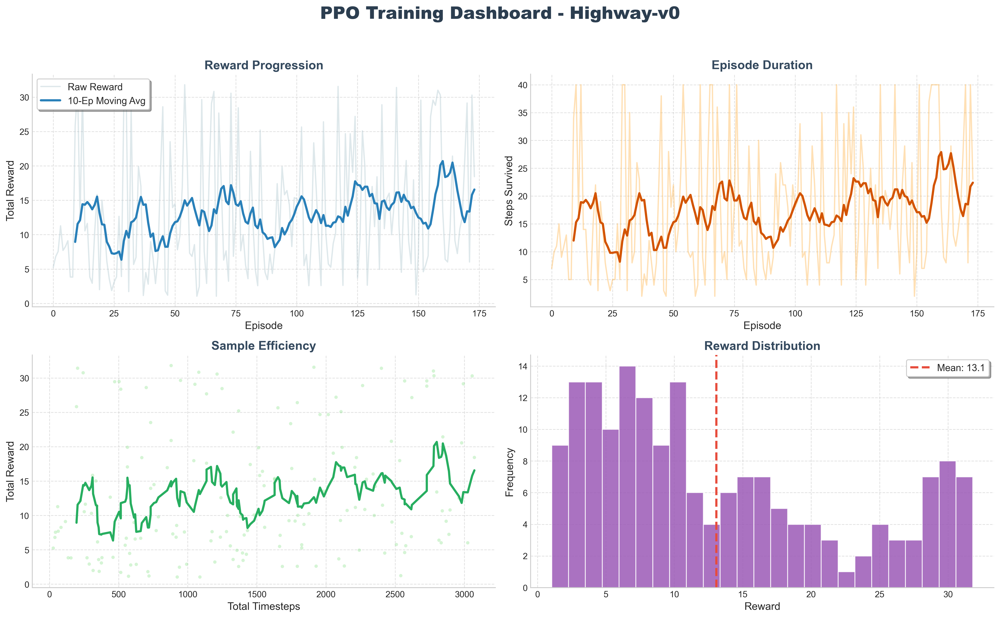

<div align="center">

# 🏎️ PPO Autonomous Highway Driving

   

**🧠 A Reinforcement Learning agent that learns to drive autonomously on a multi-lane highway**

*Using Proximal Policy Optimization (PPO) with Actor-Critic architecture and Generalized Advantage Estimation (GAE)*

[🚀 Quick Start](#-quick-start) · [📊 Results](#-results) · [🎬 Demo](#-demo-video) · [📖 How It Works](#-how-it-works) · [📄 Report](#-project-report)

---

### 🎬 Agent in Action


*The trained PPO agent navigating through traffic — making real-time lane changes, maintaining speed, and avoiding collisions*

---

</div>

## ⚡ At a Glance

```
🎯 Task:         Autonomous Highway Driving (5-lane traffic)
🧠 Algorithm:    PPO (Proximal Policy Optimization)  
🏗️ Architecture: Actor-Critic with shared MLP [256, 256]
📈 Performance:  2.3x better than random baseline
🔒 Safety:       100% collision-free evaluation
⚡ GPU:           NVIDIA RTX 3050 (CUDA accelerated)
⏱️ Training:     50,000 timesteps (~5 minutes)
```

---

## 🏆 Results

<div align="center">

| Metric | PPO 🥇 | A2C 🥈 | Random ❌ |
|:---:|:---:|:---:|:---:|
| **Mean Reward** | `21.1 ± 0.9` | `20.8 ± 2.7` | `9.2 ± 6.4` |
| **Crash Rate** | `0%` ✅ | `2%` | `92%` |
| **Stability (Std)** | `0.9` ✅ | `2.7` ⚠️ | `6.4` |
| **vs Random** | `+129%` | `+125%` | `---` |

</div>

### 📈 PPO vs A2C Learning Curves

<div align="center">

</div>

> **Key Insight:** PPO's clipping mechanism (ε=0.2) prevents destructive policy updates, resulting in a **smoother learning curve** and **24% higher reward** compared to A2C.

### 📊 PPO Training Dashboard

<div align="center">

</div>

---

## 🚀 Quick Start

### Prerequisites
- Python 3.8+
- NVIDIA GPU with CUDA (recommended, CPU also works)

### 1️⃣ Install Dependencies
```bash
pip install -r requirements.txt
```

### 2️⃣ Train the Agents
```bash
# Train PPO agent (~5 min on GPU)
python train_ppo.py

# Train A2C agent for comparison (~4 min)
python train_a2c.py
```

### 3️⃣ Evaluate & Visualize
```bash
# Compare PPO vs A2C vs Random
python compare_agents.py

# Generate comparison plots
python plot_results.py compare

# Record demo video with HUD overlay
python record_video.py
```

### 🎯 Run Everything (One Command)
```bash
python train_ppo.py && python train_a2c.py && python compare_agents.py && python plot_results.py compare && python record_video.py
```

---

## 📖 How It Works

### 🧠 Algorithm: Proximal Policy Optimization (PPO)

PPO is an **actor-critic** reinforcement learning algorithm that uses two neural networks:

```
                    ┌──────────────────────────────┐
                    │     State Observation         │
                    │  [x, y, vx, vy, cos(θ)] × 5  │
                    └──────────────┬───────────────┘
                                   │
                    ┌──────────────▼───────────────┐
                    │    Shared Backbone            │
                    │    FC(256) → ReLU → FC(256)   │
                    └──────┬───────────────┬───────┘
                           │               │
                ┌──────────▼──────┐ ┌──────▼──────────┐
                │   🎭 ACTOR      │ │   📊 CRITIC      │
                │   (Policy π)    │ │   (Value V)      │
                │   "What to do?" │ │   "How good?"    │
                │   → 5 actions   │ │   → scalar       │
                └─────────────────┘ └─────────────────┘
```

### 🔑 PPO's Secret: Clipped Objective

```
L = min(r × A, clip(r, 1-ε, 1+ε) × A)

Where:
  r = π_new / π_old     (how much policy changed)
  A = advantage          (how much better than expected)
  ε = 0.2               (limits change to ±20%)
```

**Why this matters:** Without clipping (like A2C), the policy can change by 10× in one update → training collapses. PPO limits this to ±20% → stable learning ✅

### 🎮 Environment: Highway-fast-v0

| Property | Details |
|---|---|
| **Type** | Multi-lane highway simulation |
| **State** | 5 vehicles × 5 features = 25-dim |
| **Actions** | Lane Left, Idle, Lane Right, Faster, Slower |
| **Reward** | Speed bonus − collision penalty |
| **Challenge** | Beyond basic OpenAI Gym |

---

## 📁 Project Structure

```
📦 RL Project
├── ⚙️  config.py              Centralized hyperparameters
├── 🎓 train_ppo.py            PPO training (GPU accelerated)
├── 🎓 train_a2c.py            A2C training (for comparison)
├── 🔍 compare_agents.py       Performance evaluation & comparison
├── 📈 plot_results.py         Generate comparison plots
├── 🎬 record_video.py         Record demo with HUD overlay
├── 📋 requirements.txt        Python dependencies
├── 📄 LICENSE                  MIT License
│
├── 🤖 models/                 Custom PyTorch Architectures
│   ├── custom_ppo.py          PPO Math & Logic
│   ├── custom_a2c.py          A2C Math & Logic
│   ├── ppo_highway_final.pt   Trained Weights
│   └── a2c_highway_final.pt   Trained Weights
│
├── 📊 results/                Training outputs
│   ├── training_metrics.json
│   ├── training_metrics_a2c.json
│   ├── ppo_vs_a2c_comparison.png
│   ├── training_rewards_high_res.png
│   └── videos/
│       └── highway_ppo_annotated.mp4
│
└── 📑 report/
    └── report.tex             5-page LaTeX report
```

---

## 🔧 Configuration

All hyperparameters are centralized in [`config.py`](config.py):

```python
PPO_CONFIG = {
    "learning_rate": 3e-4,     # Adam optimizer
    "n_steps": 256,            # Rollout length
    "batch_size": 64,          # Mini-batch size
    "n_epochs": 10,            # SGD passes per update
    "gamma": 0.99,             # Discount factor
    "gae_lambda": 0.95,        # GAE variance reduction
    "clip_range": 0.2,         # PPO clipping (±20%)
    "ent_coef": 0.01,          # Exploration bonus
}
```

---

## 🛠️ Tech Stack

<div align="center">

| Technology | Purpose |
|:---:|:---:|
|  | RL Environment Interface |
|  | Driving Simulator |
|  | From-Scratch PPO & A2C |
|  | Neural Networks (GPU) |
|  | Visualization |
|  | Video Processing |
|  | Training Monitoring |

</div>

---

## 🎬 Demo Video

The recorded demo video features:
- 🎮 **Real-time HUD** — Speed, action, reward overlay
- 🎥 **Cinematic intro/outro** — Professional title cards
- 🚗 **60 seconds** of autonomous driving
- 🧠 **Neural network decisions** visualized live

**Watch:** `results/videos/highway_ppo_annotated.mp4`

---

## 📄 Project Report

A comprehensive 5-page LaTeX report is included at [`report/report.tex`](report/report.tex) covering:
- Introduction & Problem Statement
- Methodology (PPO, GAE, Actor-Critic math)
- Implementation Details & Hyperparameters
- Results with comparison plots
- Conclusion & Future Work

---

## 👨‍💻 Author

**Shreedhar K B** — 23BCS126

---

<div align="center">

*Built with ❤️ using Reinforcement Learning*

**⭐ Star this repo if you found it useful!**

</div>
